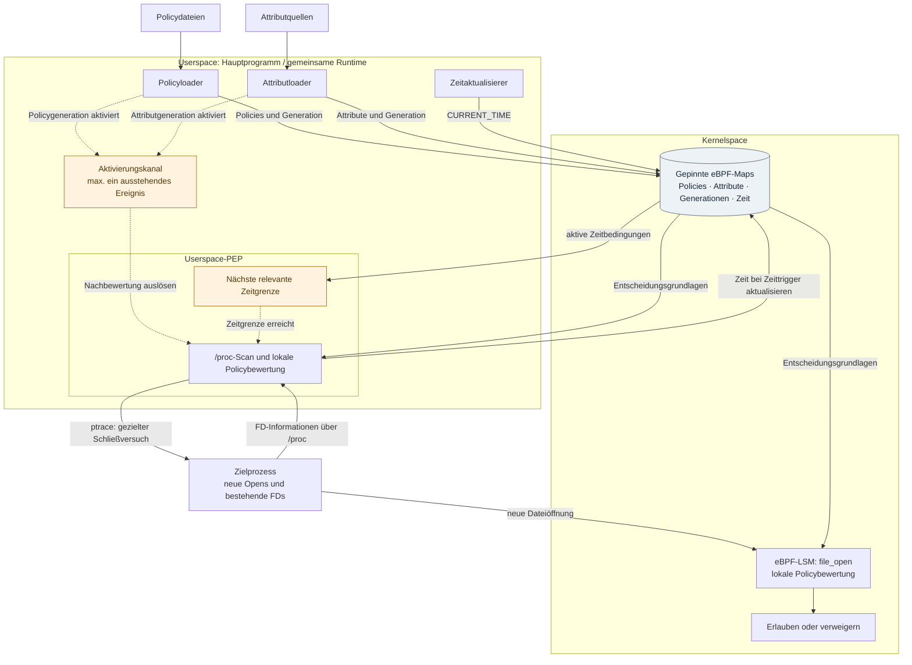

# Architekturvorschlag zu F12

**Legende:** Durchgezogene Pfeile zeigen Datenzugriffe oder Operationen, gestrichelte Pfeile Aktivierungs- und Zeitereignisse. Die Gruppierung zeigt Zuständigkeiten, keine parallelen Threads. Während des synchronen Scans warten die übrigen Zweige der gemeinsamen Runtime.

**Vorgeschlagene Bildunterschrift:** Konzeptionelle Architektur mit Zustandsbereitstellung, ereignisbasierter Nachbewertung bestehender File Descriptors und Prüfung neuer Dateiöffnungen. Erfolgreiche Policy- und Attributaktivierungen sowie relevante Zeitgrenzen lösen die Nachbewertung aus. Der nachträgliche Entzug erfolgt als Best-Effort-Schließversuch. Eigene Darstellung.

Der Zeitaktualisierer schreibt normalerweise sekündlich CURRENT_TIME, löst aber nicht bei jedem Tick einen Scan aus. Der Userspace-PEP berechnet die nächste relevante Grenze aus den aktiven Zeitbedingungen und aktualisiert bei diesem Trigger den Zeitwert selbst.

Zur Lesbarkeit ausgelassen: Initialisierung/Attach durch das Hauptprogramm, lesendes Administrationstool, interne Tail-Call-Stufen und getrennte Diagnoseausgaben. Es gibt keinen dargestellten zentralen Decision-Stream oder Log-Kanal. Der Vorschlag ersetzt die eingebundene Thesis-Grafik noch nicht.

